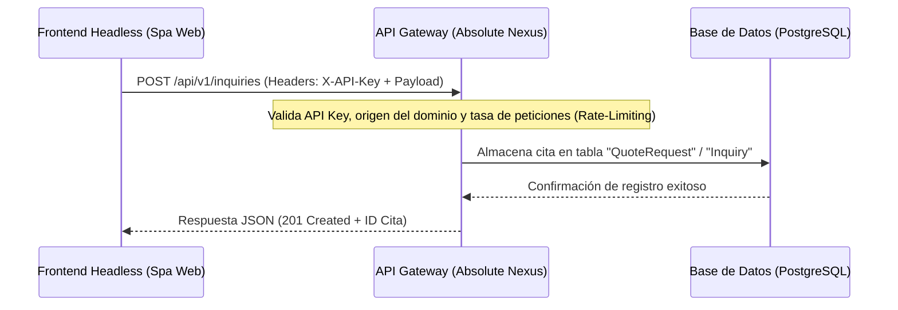

# Blueprint de Integración: Absolute Nexus ERP & Arquitectura Headless

Este documento establece la base estratégica y técnica para consolidar **Absolute Nexus** como el ERP (Cerebro Central) único de toda la infraestructura empresarial, transformando "Groomers Inc" en un cliente frontend Headless y unificando el control operativo bajo un esquema de control de acceso basado en roles (RBAC).

---

## 1. Arquitectura Headless y API Segura

La página pública del Pet Spa (`groomersincpetspa.com`) operará de forma desacoplada y consumirá la API centralizada de Absolute Nexus para registrar citas y consultar disponibilidad.



### Mecanismo de Seguridad:
1. **API Keys Estáticas Firmadas**: Las peticiones desde el frontend público utilizarán un header `X-API-Key` generado y revocado desde el panel de administración IT. Este token estará cifrado en la base de datos de Nexus.
2. **CORS y Rate-Limiting**: Se restringen las peticiones HTTP por CORS permitiendo únicamente el dominio configurado del frontend y limitando la creación de citas a un máximo de 5 peticiones por minuto por dirección IP (mediante Redis o Middleware en memoria) para prevenir denegación de servicio (DoS).
3. **Aislamiento de Privilegios**: Los endpoints públicos `/api/v1/...` solo permitirán operaciones de inserción (`POST`) de citas y consultas (`GET`) de disponibilidad horaria libres. Cualquier lectura de datos de clientes, administración o configuraciones requerirá sesiones activas autenticadas por Auth.js.

---

## 2. UI de Nexus: Estructura del Módulo Grooming

El módulo de estética canina se integra como un nuevo ítem global en la barra de navegación lateral izquierda (icono ✂️ / Tijera). Al seleccionarlo, se despliega una barra secundaria (`w-60`) y una vista de contenido adaptada.

### Estructura de Navegación en Barra Secundaria (`w-60`):
* `dashboard`: Visión de rendimiento diario, ingresos acumulados y citas completadas.
* `calendario`: Vista de calendario interactivo mensual/semanal para programar y reprogramar citas arrastrando bloques.
* `citas`: Tabla de cotizaciones pendientes, aceptadas y en curso.
* `clientes`: Directorio de dueños de mascotas y perfiles clínicos de los perros.
* `servicios`: Configuración de precios base, promociones y suplementos de peluquería.

### Estructura de Carpetas en Next.js (App Router):
```
src/
└── app/
    └── (admin)/
        └── nexus/
            ├── layout.tsx             # Layout de administración con navegación lateral
            ├── page.tsx               # Dashboard general de Nexus
            ├── grooming/
            │   ├── page.tsx           # Dashboard del módulo Grooming
            │   ├── calendario/
            │   │   page.tsx           # Vista del Calendario
            │   ├── citas/
            │   │   page.tsx           # Vista de la Tabla de Citas
            │   ├── clientes/
            │   │   page.tsx           # Vista de Clientes/Mascotas
            │   └── servicios/
            │       page.tsx           # Gestión de Tarifas
            └── it/                    # Módulo IT (Consola de Minecraft, Rendimiento VPS)
                └── ...
```

### Diseño Estético (Estilo Discord Enterprise):
* **Fondo de Contenedor Principal**: `#2B2D31` (Gris oscuro suave que descansa la vista).
* **Fondo de Elementos / Celdas**: `#1E1F22` (Gris oscuro puro para contrastar).
* **Bordes**: `#1F2023` (Delgados y limpios, separando la información).
* **Tipografía y Colores de Estado**: 
  * Texto primario: `#DBDEE1` (Blanco suave, no reflectante).
  * Estados (Pendiente/Aceptado/Rechazado): Tonos pastel desaturados (Verde `#23A55A` para aceptado, amarillo `#F0B232` para pendiente, rojo `#F23F43` para cancelaciones) en lugar de colores primarios saturados.

---

## 3. Control de Acceso (RBAC): Seguridad y Roles

El esquema de base de datos definirá una jerarquía de acceso estricta para mitigar el riesgo de fuga de datos o manipulación del sistema.

### Modificaciones en el Esquema de Prisma (`prisma/schema.prisma`):
El modelo `User` y los accesos serán gobernados por un enum o string de rol mapeado:

```prisma
model User {
  id        String   @id @default(cuid())
  name      String?
  email     String   @unique
  password  String
  role      UserRole @default(CLIENT)
  createdAt DateTime @default(now())
}

enum UserRole {
  ADMIN_GENERAL     // Acceso a todo el sistema, incluyendo IT, Consola y Base de Datos.
  GROOMER_OPERATOR  // Acceso exclusivo al módulo Grooming (calendario, citas, clientes).
  CLIENT            // Acceso solo a sus propias reservas y perfiles de mascota.
}
```

### Control de Rutas y Menús (Next.js Middleware & Components):

1. **Filtro de Componentes en Layout:**
   El layout de administración comprobará el rol del usuario actual. Si el usuario tiene el rol `GROOMER_OPERATOR`, el componente de barra lateral omitirá el renderizado del icono de la terminal `>_` (Módulo IT) y de las configuraciones de sistema.
   
2. **Protección en API Routes (`src/app/api/...`):**
   Cualquier endpoint que realice tareas de infraestructura (ej. detener el servidor de Minecraft o consultar logs de PM2) validará el rol en la sesión:
   
```typescript
const session = await auth();
if (!session || session.user.role !== "ADMIN_GENERAL") {
  return NextResponse.json({ error: "Forbidden. Requiere permisos de administrador general." }, { status: 403 });
}
```

3. **Route Guards en Servidor (App Router):**
   Las páginas del módulo `/nexus/it/...` realizarán un chequeo de sesión del lado del servidor antes de renderizarse. En caso de no cumplir la condición, redirigirán inmediatamente a una página de acceso no autorizado o al panel principal de Grooming.
